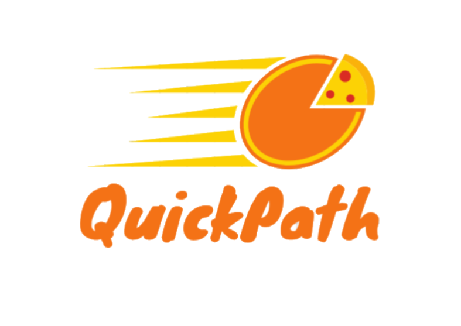

# 🍕 QuickPath - Pizza Delivery VRP System



A solution designed specifically for pizza delivery management. This Spring Boot application optimally assigns delivery orders to riders while calculating the most efficient routes using Google's OR-Tools for Capacitated Vehicle Routing Problem (CVRP) solving.

## 📋 Table of Contents

- [Features](#features)
- [System Architecture](#system-architecture)
- [Technology Stack](#technology-stack)
- [Getting Started](#getting-started)
- [Usage](#usage)
- [API Endpoints](#api-endpoints)
- [Screenshots](#screenshots)
- [Project Structure](#project-structure)
- [Contributing](#contributing)

## ✨ Features

### 🔧 Manager Features
- **Order Management**: Mark pizza orders as ready for delivery
- **Smart Assignment**: Assign orders to available riders with capacity validation
- **Capacity Control**: System prevents over-assignment when total order volume exceeds available rider capacity
- **Real-time Monitoring**: Track rider status and order progress
- **Route Optimization**: Automatic calculation of optimal delivery routes using Google OR-Tools

### 🏍️ Rider Features
- **QR Code Integration**: Scan QR codes to access Google Maps routes instantly
- **Status Management**: Check in/out system to track availability
- **Route Access**: Direct integration with Google Maps for turn-by-turn navigation
- **Order Tracking**: View assigned orders and delivery status

### 🚀 Core Functionality
- **CVRP Solver**: Advanced Capacitated Vehicle Routing Problem solving
- **Real-time Updates**: Live status tracking for both managers and riders
- **Capacity Validation**: Intelligent assignment prevention when capacity is exceeded
- **Route Optimization**: Minimizes travel time and distance for efficient deliveries

## 🏗️ System Architecture

The application follows a layered architecture pattern:

```
├── Controller Layer    # REST endpoints and web controllers
├── Service Layer      # Business logic and VRP solving
├── Repository Layer   # Data access and persistence
├── Domain Layer       # Entity models and business objects
└── Utils Layer        # VRP algorithms and helper utilities
```

### Key Components

- **OrderAssigner**: Core VRP solver that assigns orders to riders
- **DistanceMatrixCalculator**: Calculates distances between delivery points
- **Solver**: Implements Google OR-Tools CVRP algorithms
- **QR Code Generator**: Creates scannable links to Google Maps routes

## 🛠️ Technology Stack

- **Backend**: Spring Boot 3.3.5
- **Language**: Java 17
- **Database**: H2 (in-memory for development)
- **ORM**: Spring Data JPA
- **Frontend**: Thymeleaf templates with Bootstrap 4.5.2
- **VRP Solver**: Google OR-Tools
- **Build Tool**: Maven
- **Testing**: JUnit 5

## 🚀 Getting Started

### Prerequisites

- Java 17 or higher
- Maven 3.6 or higher
- Git

### Installation

1. **Clone the repository**
   ```bash
   git clone <repository-url>
   cd vrp-main
   ```

2. **Build the project**
   ```bash
   ./mvnw clean install
   ```

3. **Run the application**
   ```bash
   ./mvnw spring-boot:run
   ```

4. **Access the application**
   - Open your browser and navigate to `http://localhost:8080`
   - The application will automatically initialize with sample data

## 📱 Usage

### For Managers

1. **Access Manager Dashboard**
   - Navigate to the home page
   - Click "Manage Orders" to view pending orders

2. **Assign Orders**
   - Select orders that are ready for delivery
   - Click "Assign Orders" 
   - System validates total capacity vs. order volume
   - Orders are automatically assigned to optimal riders

3. **Monitor Operations**
   - View rider status (Available, On Route, etc.)
   - Track order progress and delivery status

### For Riders

1. **Check Status**
   - Access the riders page to view your current status
   - Update availability (At Restaurant, On Route)

2. **Access Routes**
   - Scan the generated QR code for your assigned orders
   - QR code opens Google Maps with optimized route
   - Follow turn-by-turn navigation

3. **Update Status**
   - Mark when leaving the restaurant
   - Update status upon return

## 🔌 API Endpoints

### Order Management
- `GET /orders` - View all orders
- `POST /orders/assign` - Assign selected orders to riders
- `GET /orders/ready` - Get orders ready for delivery

### Rider Management
- `GET /riders` - View all riders
- `POST /riders/{id}/status` - Update rider status
- `GET /riders/available` - Get available riders

### Main Navigation
- `GET /` - Home page
- `GET /orders` - Orders management page
- `GET /riders` - Riders management page

## 📸 Screenshots

The application includes several interface screenshots:


*Manager dashboard showing order assignment interface*


*Rider management and status tracking*

## 📁 Project Structure

```
src/
├── main/
│   ├── java/es/unex/cum/mdai/vrp/
│   │   ├── controller/          # REST controllers
│   │   │   ├── FoodDeliveryOrderController.java
│   │   │   ├── MainController.java
│   │   │   └── RiderController.java
│   │   ├── domain/              # Entity models
│   │   │   ├── FoodDeliveryOrder.java
│   │   │   ├── OrderStatus.java
│   │   │   ├── Rider.java
│   │   │   └── RiderStatus.java
│   │   ├── repository/          # Data access layer
│   │   │   ├── FoodDeliveryOrderRepository.java
│   │   │   └── RiderRepository.java
│   │   ├── services/            # Business logic
│   │   │   ├── FoodDeliveryOrderService.java
│   │   │   ├── FoodDeliveryOrderServiceImpl.java
│   │   │   ├── RiderService.java
│   │   │   └── RiderServiceImpl.java
│   │   ├── utils/               # VRP algorithms
│   │   │   ├── DataModel.java
│   │   │   ├── DistanceMatrixCalculator.java
│   │   │   ├── OrderAssigner.java
│   │   │   └── Solver.java
│   │   ├── DataBaseInitializer.java
│   │   └── VrpApplication.java
│   └── resources/
│       ├── templates/           # Thymeleaf templates
│       │   ├── Home.html
│       │   ├── orders.html
│       │   └── riders.html
│       ├── static/              # Static resources
│       └── application.properties
└── test/                        # Test files
    └── java/es/unex/cum/mdai/
        ├── SolverTest.java
        └── VrpApplicationTests.java
```

## 🧠 VRP Algorithm Details

The system implements a Capacitated Vehicle Routing Problem (CVRP) solver with the following characteristics:

- **Objective**: Minimize total travel distance/time
- **Constraints**: 
  - Vehicle capacity limits
  - Single depot (restaurant location)
  - Each customer visited exactly once
- **Solver**: Google OR-Tools optimization library
- **Features**:
  - Dynamic rider assignment
  - Real-time capacity validation
  - Route optimization with Google Maps integration

## 🔧 Configuration

### Application Properties

```properties
spring.application.name=vrp
spring.web.resources.static-locations=file:./qr-images/
```

### Database Configuration

The application uses H2 in-memory database for development. For production, update the `application.properties` file with your database configuration.

## 👥 Author

**Pablo Setrakian Bearzotti**

---

**QuickPath** - Optimizing pizza delivery one route at a time! 🍕🚀
